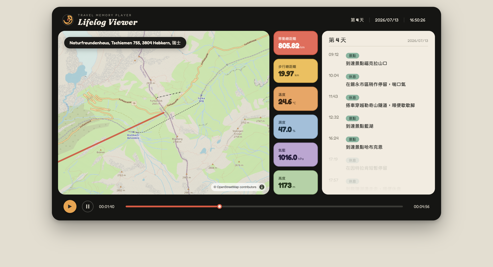

# Lifelog Viewer

A "Travel Memory Player" — replay a trip day by day on a live map. A single
playhead drives everything at once: the header clock advances, the pin travels
the route, the stat readouts interpolate, and the timeline reveals events as you
pass them. Scrub the bottom bar (or hit play) to move through the journey like a
video.



Ported from a self-contained prototype into a real Vite + React app so it can
grow into a service: real map tiles (MapLibre GL), a proper data layer, and a
normal build/deploy pipeline.

## Run it

```bash
npm install
npm run dev      # http://localhost:5173
npm run build    # production build to dist/
npm run preview  # serve the production build locally
```

Node 18+ recommended.

## Maps

By default the app uses raster **OpenStreetMap** tiles so it works with zero
config. OSM's public tile server is **not** for production traffic, so for
anything real, get a free key and switch to a vector basemap:

```bash
cp .env.example .env
# then set VITE_MAPTILER_KEY=your_key   (https://www.maptiler.com/)
```

`MapView.jsx` uses the MapTiler style when a key is present and falls back to
OSM otherwise. Other keyed providers (Stadia, Protomaps, Mapbox) drop in the
same way — just swap the style URL.

## Project structure

```
src/
  theme.js               design tokens: palette, fonts, stat + category config
  App.jsx                root
  components/
    LifelogViewer.jsx    playhead state + assembles the panels
    Header.jsx           logo + live day/date/clock
    MapView.jsx          MapLibre GL: route line + moving pin
    StatColumn.jsx       six stat pills (interpolated values)
    Timeline.jsx         event list with day dividers + active/faded states
    PlayerBar.jsx        play/pause/stop + draggable seek rail
    GpxImport.jsx        header control: import a GPX by upload or URL
    Spiral.jsx           logo mark
  lib/
    time.js              timestamp parsing + clock/duration formatting
    geo.js               route coords + time-based interpolation
    gpx.js               GPX track -> samples[] / trip (import helper)
  data/
    useTrip.js           loads + derives a trip (route, time range, events)
public/data/
    trip-switzerland.json  sample trip (swap for real data)
scripts/
    gpx-to-trip.mjs        CLI: convert a .gpx file into a trip JSON
```

## Data schema

`useTrip` fetches a JSON trip. A trip has metadata, a `days[]` list of timeline
events, and a `samples[]` GPS+sensor track. The playhead interpolates across
`samples`; the timeline reveals `events` as their timestamp is passed.

```jsonc
{
  "id": "switzerland-2026",
  "title": "Switzerland",
  "place": "Naturfreundenhaus, Tschiemen 755, 3804 Habkern",
  "country": "瑞士",
  "playbackSeconds": 296,          // length of the scrubber
  "days": [
    {
      "day": 4,
      "date": "2026-07-13",
      "events": [
        { "time": "16:24", "category": "scenic", "text": "到達景點哈布克恩", "lng": 7.871, "lat": 46.751 }
      ]
    }
  ],
  "samples": [
    // one point per GPS/sensor reading; all numeric fields are interpolated
    { "t": "2026-07-13T16:50:26", "lng": 7.876, "lat": 46.753,
      "alt": 1173, "tempC": 24.6, "humidityPct": 47.0, "pressureHpa": 1016.0,
      "movedKm": 805.82, "walkKm": 19.97 }
  ]
}
```

`category` is one of `scenic` / `rest` / `lodging` (mapped to 景點 / 休息 / 住宿
in `theme.js` — add your own there).

## Importing a GPX track

Two ways to bring in a real recorded track.

**In the app.** Click **＋ 匯入 GPX** in the header and either upload a `.gpx`
file or paste a link to one. The track is parsed in the browser and replayed
immediately — no server round-trip. Set the **時區 (timezone)** offset so the
header clock reads local time (it defaults to your browser's zone). A pasted
link must be same-origin or CORS-enabled, or the fetch is blocked.

**On the command line.** Turn a track into a trip JSON with the bundled
converter:

```bash
node scripts/gpx-to-trip.mjs my-hike.gpx --tz=+02:00 \
  --title="Switzerland" --place="Habkern" --country="瑞士" --walk-as-moved \
  --out public/data/my-trip.json
# then load it: useTrip("/data/my-trip.json")
```

GPX only carries position, elevation, time, and (via the Garmin
TrackPointExtension) air temperature, so the converter fills the rest of each
sample: `movedKm` is the cumulative great-circle distance, `pressureHpa` is
derived from altitude, and `tempC` / `humidityPct` fall back to constants you
can override. Timeline `events` aren't in a GPX track, so `days[].events` start
empty — add them afterwards.

**Times are the one gotcha.** GPX timestamps are UTC, but the app reads sample
times as *local* wall-clock (see [Data schema](#data-schema) / `lib/time.js`).
Pass `--tz` with the trip's local offset (e.g. `+02:00` for CEST) so the header
clock reads local time. Run with `--help` for all flags. The parsing itself
lives in `src/lib/gpx.js` (`gpxToSamples` / `gpxToTrip`) and has no
dependencies, so you can call it from the browser too.

## Where to take it next

- **Ingest real data.** GPX tracks import via `scripts/gpx-to-trip.mjs` (see
  above); extend `src/lib/gpx.js` for FIT or other formats. Pull timeline events
  from photos, calendar, or notes. Replace the static fetch in `useTrip.js` with
  an API call.
- **Multiple trips.** Add a trip picker; `useTrip(url)` already takes a URL.
- **Backend + persistence.** Store trips in a DB; add auth so it's per-user.
- **Traveled vs. remaining route.** Split the route line into a solid
  "already traveled" portion and a faded "ahead" portion at the playhead.
- **Deploy.** Any static host works (`npm run build` → `dist/`): Vercel,
  Netlify, Cloudflare Pages, GitHub Pages.

## Fonts

Fredoka (rounded numerals/Latin) and Noto Sans TC load from Google Fonts;
Huninn 粉圓 (rounded Traditional-Chinese) loads from a CDN with Noto Sans TC as
the fallback. To self-host, drop the files in `public/` and update the
`@font-face`/`@import` in `src/index.css`.
